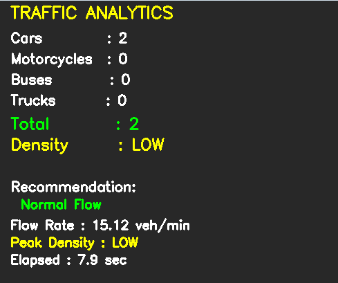
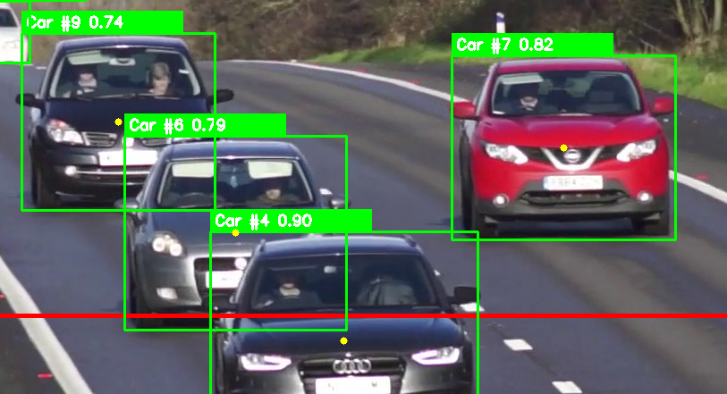
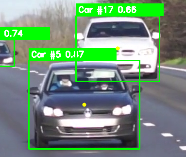
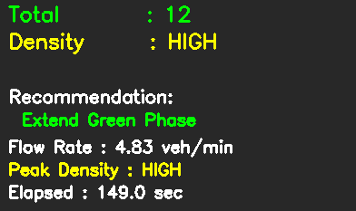
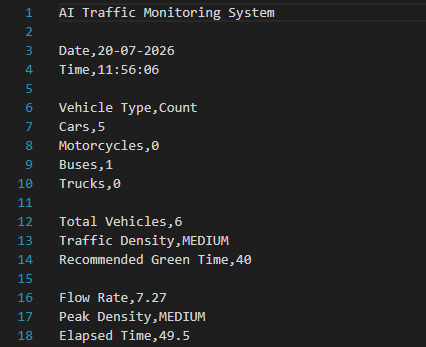

# 🚦 AI Traffic Monitoring System

<div align="center">


**An AI-powered real-time traffic monitoring and adaptive signal timing system using YOLOv8, ByteTrack, and OpenCV.**

</div>

---

# 📌 Overview

The AI Traffic Monitoring System is a computer vision project that detects, tracks, and counts vehicles from traffic surveillance videos.

Using **YOLOv8** for object detection and **ByteTrack** for multi-object tracking, the system performs real-time traffic analytics including:

- Vehicle Detection
- Vehicle Tracking
- Vehicle Counting
- Traffic Density Estimation
- Adaptive Signal Timing
- Traffic Statistics
- CSV Report Generation

This project demonstrates practical applications of Artificial Intelligence and Computer Vision in Intelligent Transportation Systems (ITS).

---

# ✨ Features

- ✅ Real-time Vehicle Detection (YOLOv8)
- ✅ Multi-Object Tracking (ByteTrack)
- ✅ Vehicle Classification
- ✅ Line Crossing Counter
- ✅ Live Analytics Dashboard
- ✅ Traffic Density Estimation
- ✅ Adaptive Traffic Signal Recommendation
- ✅ Flow Rate Calculation
- ✅ Peak Density Monitoring
- ✅ CSV Report Generation
- ✅ Modular Python Architecture

---

# 🧠 Technologies Used

| Technology | Purpose |
|------------|---------|
| Python | Programming Language |
| YOLOv8 | Vehicle Detection |
| ByteTrack | Multi-object Tracking |
| OpenCV | Image Processing |
| NumPy | Numerical Operations |
| CSV | Report Generation |
| Git | Version Control |

---

# 📂 Project Structure

```text
AI-Traffic-Monitoring-System
│
├── assets/
│   └── videos/
│
├── docs/
├── models/
├── reports/
├── screenshots/
│
├── src/
│   ├── analytics/
│   │   ├── line_counter.py
│   │   ├── traffic_density.py
│   │   ├── signal_controller.py
│   │   ├── traffic_statistics.py
│   │   ├── report_generator.py
│   │   └── vehicle_counter.py
│   │
│   ├── detection/
│   ├── tracking/
│   ├── utils/
│   └── main.py
│
├── requirements.txt
├── README.md
├── LICENSE
└── .gitignore
```

---

# ⚙️ Installation

Clone the repository

```bash
git clone https://github.com/DivyomSrivastava/AI-Traffic-Monitoring-System.git
```

Move into the project directory

```bash
cd AI-Traffic-Monitoring-System
```

Install dependencies

```bash
pip install -r requirements.txt
```

Download the YOLOv8 model

```
models/
└── yolov8n.pt
```

---

# ▶️ Run the Project

```bash
py src/main.py
```

---

# 📊 Dashboard

The dashboard displays

- Vehicle Count
- Cars
- Motorcycles
- Buses
- Trucks
- Total Vehicles
- Traffic Density
- Green Signal Recommendation
- Recommended Green Time
- Flow Rate
- Peak Density
- Elapsed Time

---

# 📄 CSV Report

Press

```
S
```

to save a report.

Reports are automatically stored inside

```
reports/
```

Example

```
traffic_report_2026-07-20_23-45-18.csv
```

The report contains

- Vehicle Counts
- Density
- Green Signal Timing
- Flow Rate
- Peak Density
- Elapsed Time

---

# 🏗️ System Workflow

```
Traffic Video
      │
      ▼
YOLOv8 Vehicle Detection
      │
      ▼
ByteTrack Tracking
      │
      ▼
Vehicle Counting
      │
      ▼
Traffic Density Estimation
      │
      ▼
Adaptive Signal Timing
      │
      ▼
Traffic Statistics
      │
      ▼
CSV Report Generation
```

---

# 🚀 Future Improvements

- Traffic Heatmaps
- Vehicle Speed Estimation
- Traffic Prediction using AI
- Web Dashboard
- Live CCTV Streaming
- Multi-Camera Support
- Emergency Vehicle Detection
- Number Plate Recognition (ANPR)
- Cloud Deployment
- Smart City Integration

---

# 📸 Screenshots

## Dashboard



---

## Vehicle Detection



---

## Vehicle Tracking



---

## Traffic Density


---

## Traffic Statistics



---

## CSV Report




---

# 👨‍💻 Author

**Divyom Srivastava**

GitHub

https://github.com/DivyomSrivastava

LinkedIn

https://www.linkedin.com/in/divyom-srivastava-260b95342/

---

## ⭐ If you found this project useful, consider giving it a star!
